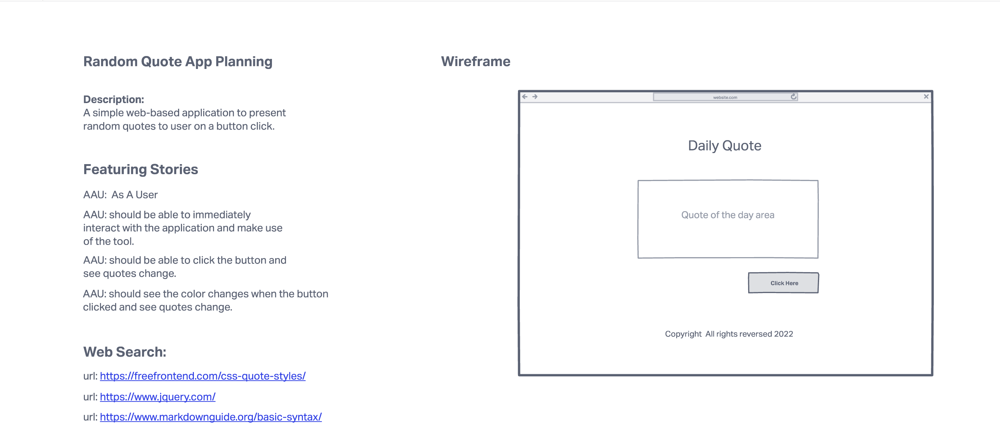
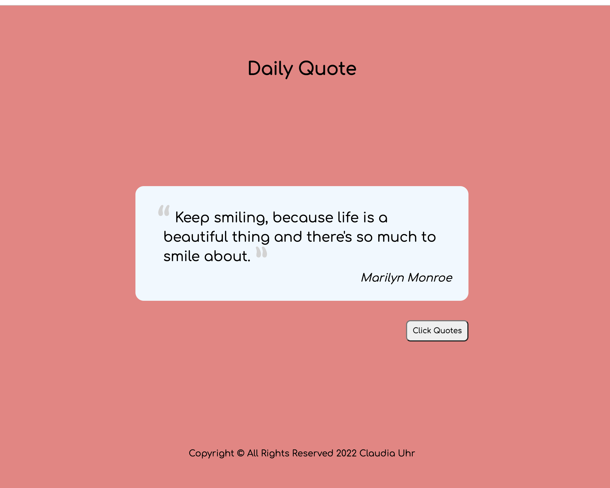

# Random Quotes Project

## Description

A simple web-based application to present random quotes to user on a button click.

## Technologies Used

- HTML5
- CSS3
- JavaScript/JQuery
- Open Source Api by Rapidapi.com
- Git/GitHub - Github Pages for Hosting

## Screenshots

## Getting started

[Click here](https://claudiauhr.github.io/random-quotes-project/) to visit the deployed app!

## Future Enhancements

- Adding a feature that when a new quote is generate change bacckground color and button color.
- Adding a drop list that allows user to choose quotes by type.
- Adding a feature that allows users to choose by author.
